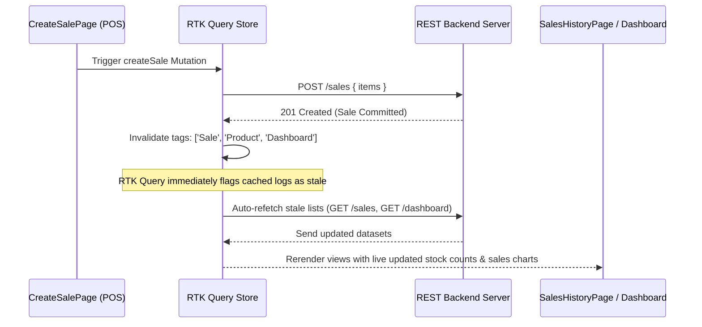

# ClassyERP Client - Inventory & Sales Management System

An enterprise-grade frontend dashboard application built using **React 19, TypeScript, Redux Toolkit (RTK Query), Tailwind CSS, React Router v8, and Socket.io-client**.

This document serves as the absolute onboarding blueprint for new developers to understand the project architecture, data flows, state management, real-time sync systems, and security constraints.

---

## 📖 Table of Contents

1. [💻 Core Tech Stack](#-core-tech-stack)
2. [📂 Project Folder Blueprint](#-project-folder-blueprint)
3. [⚙️ Architectural Separation (Pages vs. Features)](#️-architectural-separation-pages-vs-features)
4. [🔄 Data Flow & RTK Query Caching System](#-data-flow--rtk-query-caching-system)
5. [🧠 State Management Strategy](#-state-management-strategy)
6. [🔌 Real-Time Socket.io Lifecycle](#-real-time-socketio-lifecycle)
7. [🛡️ Role-Based Access Control (RBAC) & Guards](#️-role-based-access-control-rbac--guards)
8. [🚀 Local Setup & Configuration](#-local-setup--configuration)
9. [🎨 Design System & Responsiveness Guidelines](#-design-system--responsiveness-guidelines)

---

## 💻 Core Tech Stack

- **Runtime & Compiler**: React 19, Vite, TypeScript
- **State & Caching Engine**: Redux Toolkit, Redux Toolkit Query (RTK Query)
- **Routing**: React Router (v8)
- **Real-time Connection**: Socket.io-client (v4)
- **Form & Validation**: React Hook Form + Zod Resolver
- **Styling**: Tailwind CSS
- **Asset Library**: Lucide React, Sonner (Toasts)

---

## 📂 Project Folder Blueprint

```
client/src/
├── app/                  # Redux global store configurations & custom React-Redux hooks
│   ├── hooks.ts          # Typed wrappers: useAppSelector and useAppDispatch
│   └── store.ts          # Main Redux store registering Auth, baseApi, and middleware
├── components/           # Core layout shells and shared presentation components
│   ├── layout/           # AppShell.tsx, Sidebar.tsx, Topbar.tsx, RoleBadge.tsx
│   └── shared/           # Pagination, PageHeader, EmptyStates, ConfirmDialogs, SearchInput
├── context/              # Context providers (e.g. ThemeContext.tsx for Dark/Light mode)
├── features/             # Business Domain capsules (domain views, forms, and calculations)
│   ├── auth/             # LoginPage.tsx, ProtectedRoute.tsx, RoleGuard.tsx
│   ├── dashboard/        # DashboardPage.tsx, LowStockTable.tsx
│   ├── products/         # ProductsPage.tsx, ProductFormDialog.tsx
│   ├── sales/            # CreateSalePage.tsx, SalesHistoryPage.tsx, ProductPickerRow.tsx
│   └── users/            # UsersPage.tsx, UserFormDialog.tsx
├── lib/                  # Shared business helper modules, permission arrays, and API queries
│   ├── apiBaseQuery.ts   # Axios/Fetch custom base queries for RTK Query
│   ├── permissions.ts    # Enums and rules determining role-based route permissions
│   ├── socket.ts         # Singleton Socket.io client manager (connect/disconnect hooks)
│   └── utils.ts          # Currency formatters, Date formatters, Tailwind merging wrappers
├── pages/                # Clean routing page containers mapped inside the Router
│   ├── CreateSale.tsx    # Mounts features/sales/CreateSalePage
│   ├── Dashboard.tsx     # Mounts features/dashboard/DashboardPage
│   ├── Login.tsx         # Mounts features/auth/LoginPage
│   ├── Products.tsx      # Mounts features/products/ProductsPage
│   ├── SalesHistory.tsx  # Mounts features/sales/SalesHistoryPage
│   ├── Users.tsx         # Mounts features/users/UsersPage
│   └── NotFound.tsx      # Customized 404 fallback page container
├── redux/                # Redux state slices and RTK Query endpoints
│   ├── api/              # baseApi.ts registering global tagTypes and headers
│   └── features/         # Sub-folder APIs (authApi.ts, productsApi.ts, salesApi.ts, etc.)
├── routes/               # Routing map registries (AppRoutes.tsx)
├── skeleton/             # Dedicated directory containing all page skeleton loaders
│   ├── DashboardSkeleton.tsx
│   ├── ProductsSkeleton.tsx
│   ├── SalesHistorySkeleton.tsx
│   └── UsersSkeleton.tsx
├── types/                # Strict TypeScript global entity interfaces (user, sale, product)
├── App.tsx               # Root component wrapping Redux Provider and ThemeContext
└── main.tsx              # React mounting entry point compiling styling sheets
```

---

## ⚙️ Architectural Separation (Pages vs. Features)

To maintain a clean, maintainable architecture, we separate routing files from business domain features:

```
[ Router (AppRoutes) ]
         │
         ▼
    [ src/pages/* ]        <--- Thin routing containers (bind route paths to features)
         │
         ▼
   [ src/features/* ]     <--- Rich feature layouts (contain forms, tables, logic)
```

1. **`src/pages/`**: Serves as the entry-point page routing boundary mapped by `AppRoutes.tsx`. These files contain **no inline style sheets, state computations, or API triggers**. They simply mount the primary layout container from features.
2. **`src/features/`**: Capsule directories split by business domain. Contains rich page details, form handlers, validation schemas, and nested subcomponents (e.g., product selection fields in checkout).

---

## 🔄 Data Flow & RTK Query Caching System

Data fetching, caching, and cache invalidation are fully managed using RTK Query. We utilize **Declarative Cache Invalidation** via cache tags (`providesTags` and `invalidatesTags`).

### Cache Tag Directory

- **`"Dashboard"`**: Invalidated when new products are created/deleted, sales are completed, or when real-time stock alerts trigger.
- **`"Product"`**: Lists and individual items are cached. Invalidated on product creation, updates, or deletions.
- **`"Sale"`**: Sales ledger results are cached. Invalidated when a checkout order is committed.
- **`"User"`**: User accounts registry cache. Invalidated on user creation, profile edits, status toggles, or deletions.

### Live Cache Invalidation Lifecycle Example



---

## 🧠 State Management Strategy

We maintain a strict separation between **Client State** and **Server State**:

### 1. Client State

- **Global Auth Session**: Handled in `authSlice.ts`. Stores the active user profile (`User | null`) and authorization tokens. Synchronized with `localStorage` for page-reload persistence.
- **Form States**: Localized within components using `react-hook-form` (Zod-validated). Unsubmitted inputs are preserved on server errors (like stock shortfalls) and only cleared on a successful API response.
- **UI States**: Modal open states, dropdown selectors, theme states (Dark/Light), active paginations are strictly localized.

### 2. Server State (RTK Query)

- Read operations map to queries (`useGetProductsQuery`, `useGetSalesQuery`, etc.). All loading screens return skeletons during fetch delays.
- Write operations map to mutations (`useCreateProductMutation`, `useUpdateUserMutation`, etc.). Submit buttons are disabled and show spinner states during execution.

---

## 🔌 Real-Time Socket.io Lifecycle

WebSocket connectivity enables instant, multi-client synchronization. To prevent unauthorized eavesdropping, we utilize a unified connection lifecycle hook:

### 1. Connection Lifecycle

- The application runs a top-level reactive hook in [AppRoutes.tsx](file:///home/muzahid/MainDrive/Developments/MyPortfolio/MERN-Stack/ClassyERP/client/src/routes/AppRoutes.tsx).
- When `state.auth.token` changes (upon login or app rehydration):
  - **Connects**: Instantiates a single socket client: `connectSocket(token)`. Passes the JWT bearer token in the connection handshake.
  - **Disconnects**: Calls `disconnectSocket()` upon logout or when the token becomes null.
  - **Handshake Validation**: If the socket server rejects the connection (expired/invalid token), the handler dispatches `logout()` and redirects to `/login`.

### 2. Real-Time UI Sync & Optimistic Caching

Instead of spamming the server with full refetch queries on every event, we listen to real-time events and patch or invalidate local caches accordingly:

- **`newSale`**: Listened to on the Dashboard & Sales History pages. Invalidates `"Sale"` and `"Dashboard"` tags to load fresh datasets.
- **`lowStockAlert`**: Listened to on the Dashboard. Triggers an alert warning toast and invalidates the `"Dashboard"` tag to show low-stock warnings instantly.
- **`stockUpdated`**: Listened to on the Products catalog page. It intercepts the event and uses RTK Query's `updateQueryData` to patch the product's `stockQuantity` directly in the cache:
  ```typescript
  // In ProductsPage.tsx
  socket.on('stockUpdated', (payload) => {
    dispatch(
      productsApi.util.updateQueryData('getProducts', { search, page, limit }, (draft) => {
        const product = draft.products.find((p) => p._id === payload.productId);
        if (product) product.stockQuantity = payload.stockQuantity;
      })
    );
  });
  ```
  _(No network overhead, instant updates)._

---

## 🛡️ Role-Based Access Control (RBAC) & Guards

We enforce route guards and UI elements pruning using standard, role-based clearance permissions (`src/lib/permissions.ts`):

- **`ProtectedRoute`**: Blocks unauthenticated sessions, redirecting guests to `/login`.
- **`RoleGuard`**: Blocks authenticated users lacking permission scopes for specific routes (e.g., Employees attempting to open user management or dashboard page), rendering an access-denied screen.
- **UI Controls Trim**: Action buttons (like edit, delete, and add) are conditionally hidden or disabled based on user permissions.
- **Self-Delete Safeguard**: On the User Management screen, the application compares table entries against the logged-in administrator's profile. An admin cannot delete or deactivate their own account, preventing accidental lockouts.

---

## 🚀 Local Setup & Configuration

### 1. Configuration Setup

Create a `.env` file in the client root directory based on `.env.example`:

```bash
VITE_API_URL=http://localhost:5000/api/v1
VITE_SOCKET_URL=http://localhost:5000
```

### 2. Local Commands

**Install packages:**

```bash
yarn install
```

**Start the local development server:**

```bash
yarn dev
```

**Compile typescript build checks and package assets for production:**

```bash
yarn build
```

---

## 🎨 Design System & Responsiveness Guidelines

We use Vanilla CSS and Tailwind to build a premium, highly responsive user interface:

### 1. Mobile-Responsive Data Grids

To avoid horizontal scrollbars on mobile viewports:

- Tables use Tailwind responsive displays (`hidden md:block` for the grid, and `grid md:hidden` for mobile stacked cards).
- Below `768px`, table rows automatically wrap into cards showing details with proper margins.

### 2. Form Dialog Configurations

- On mobile viewports, form modals expand to full width with small side margins.
- On desktop, modals are centered and bound to a maximum width (`max-w-md` or `max-w-2xl`).

### 3. Badge Design Token Guidelines

We use soft, bordered badges to represent stock and user roles:

- **Critical Stock ($\le 2$)**: `bg-red-50 text-red-700 border-red-200`
- **Low Stock ($< 5$)**: `bg-amber-50 text-amber-700 border-amber-200`
- **Healthy Stock ($\ge 5$)**: `bg-emerald-50 text-emerald-700 border-emerald-200`
